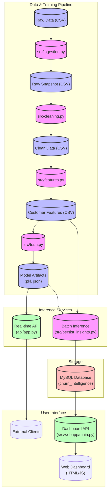

# Customer Churn - Architecture Overview

This document outlines the architecture of the Customer Churn Revenue Optimization Intelligence System.

## High-Level Architecture

The system consists of three main subsystems:
1.  **Data & Training Pipeline**: Handles data ingestion, processing, feature engineering, and model training.
2.  **Inference Services**:
    -   **Real-time API**: Provides churn predictions for individual customers via REST API.
    -   **Batch Processing**: Generates insights and predictions for the entire customer base and stores them in a database.
3.  **Visualization**: A web dashboard to view business insights and churn metrics.

## Data Flow Diagram

## Component Details

### 1. Data Processing Loop
-   **`src/ingestion.py`**: Loads raw data and saves a timestamped snapshot to ensure reproducibility.
-   **`src/cleaning.py`**: Cleans the data (handling missing values, duplicates, types) and produces `clean_customers.csv`.
-   **`src/features.py`**: Engineered features (e.g., `tenure_group`, `avg_monthly_spend`) are added, saving to `customer_features.csv`.

### 2. Model Training
-   **`src/train.py`**:
    -   Loads feature data.
    -   Trains multiple models (Logistic Regression, Random Forest).
    -   Evaluates and selects the best model based on ROC-AUC.
    -   Saves the model (`churn_model.pkl`), scaler, and metadata to the `models/` directory.

### 3. Real-time Inference (`api/`)
-   **`api/app.py`**: A FastAPI application.
    -   Loads the saved model artifacts on startup.
    -   Exposes a `/predict` endpoint that accepts customer data JSON and returns churn probability and risk level.
    -   Used for integrating churn prediction into other operational systems.

### 4. Batch Insights & Dashboard (`src/`)
-   **`src/persist_insights.py`**: Runs predictions on the entire dataset.
    -   Calculates business KPIs (Expected Revenue Loss, Churn Rate).
    -   Stores predictions and KPIs into a **MySQL** database.
-   **`src/webapp/main.py`**: A FastAPI backend for the dashboard.
    -   Queries the MySQL database to serve KPIs, segment insights, and high-risk customer lists.
    -   Serves the static frontend (HTML/CSS/JS) for visualization.

## Infrastructure
-   **Docker**: The `docker-compose.yml` defines the `mysql` service and the `api` service.
-   **CI/CD**: `.github/workflows/data_pipeline.yml` runs automated tests on the API and model integration.
