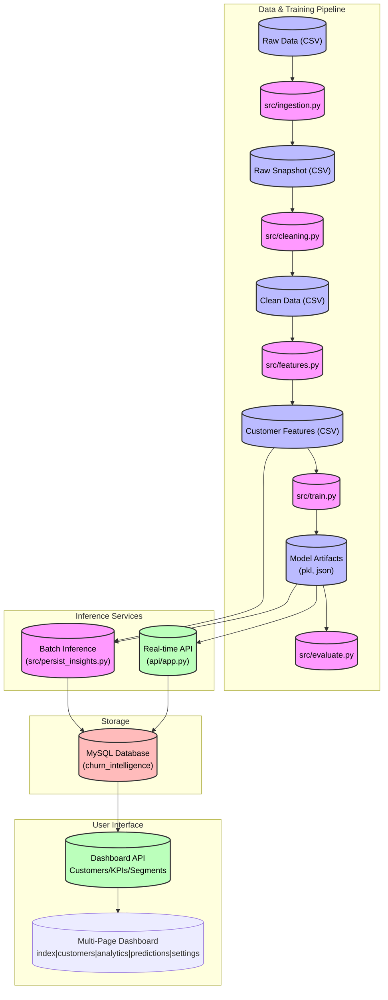

# 📊 Customer Churn & Revenue Optimization Intelligence System  
**End-to-End Data Science + Machine Learning + DevOps + Web Application**

> **Status:** ✅ Active Development | 🚀 Core Features Complete

A production-ready decision intelligence system that predicts customer churn, quantifies revenue risk, and empowers business stakeholders with actionable insights. This project demonstrates the complete ML lifecycle—from raw data to a fully deployed, interactive web dashboard with real-time API integration.

---

## 🔍 Problem Statement

Customer churn directly impacts revenue, but most organizations detect it **after** the loss occurs. This system answers three critical business questions:
1. **Who is likely to churn next?**  
2. **How much revenue is at risk due to churn?**  
3. **Which customers should be prioritized for retention?**

---

## 🎯 Solution Architecture

### High-Level Architecture

The system consists of four integrated subsystems:
1. **Data & ML Pipeline**: Ingestion → Cleaning → Feature Engineering → Model Training & Evaluation
2. **Inference Services**:
   - **Real-time API**: Individual customer churn predictions via REST endpoints
   - **Batch Processing**: Dataset-wide predictions stored in MySQL
3. **Database Layer**: MySQL storage for predictions, KPIs, and analytics
4. **Interactive Dashboard**: Multi-page web application with live API data integration

### Data Flow Diagram



### Component Details

#### 1. Data Processing Pipeline
-   **`src/ingestion.py`**: Loads raw data with timestamped snapshots for reproducibility
-   **`src/cleaning.py`**: Data cleaning (missing values, duplicates, type conversions) → `clean_customers.csv`
-   **`src/features.py`**: Feature engineering (`tenure_group`, `avg_monthly_spend`, etc.) → `customer_features.csv`

#### 2. Model Training & Evaluation
-   **`src/train.py`**:
    -   Trains multiple models (Logistic Regression with StandardScaler, Random Forest)
    -   Compares models based on ROC-AUC, Precision, Recall
    -   Auto-selects best model and saves artifacts (`churn_model.pkl`, `scaler.pkl`, `feature_list.json`, `model_metadata.json`)
    -   Handles target encoding (`yes/no` → `1/0`) and categorical feature encoding
-   **`src/evaluate.py`**:
    -   Loads trained model and test data
    -   Calculates performance metrics (ROC-AUC, Precision, Recall, Confusion Matrix)
    -   Performs threshold analysis (0.4, 0.5, 0.6, 0.7)
    -   CI/CD performance gate (minimum ROC-AUC threshold)

#### 3. Real-time Inference API (`api/app.py`)
FastAPI application (v3.0.0) with comprehensive endpoints:

**Core Prediction:**
- `POST /predict` - Individual customer churn prediction with automatic database persistence

**Dashboard APIs:**
- `GET /api/dashboard/summary` - Overall KPIs (total predictions, avg churn %, high-risk count, revenue at risk)
- `GET /api/dashboard/priority_customers` - Top 20 customers by priority score
- `GET /api/risk_distribution` - Risk bucket distribution (LOW/MEDIUM/HIGH)
- `GET /api/customers` - All customer predictions with pagination
- `GET /api/segments` - Customer segmentation analytics
- `GET /api/kpis` - Business intelligence metrics

**Features:**
- CORS enabled for frontend integration
- Environment-based configuration (.env support)
- Automatic feature alignment with training schema
- Graceful scaler handling (tree-based vs linear models)
- Comprehensive error handling and logging

#### 4. Batch Processing & Persistence
-   **`src/persist_insights.py`**: 
    -   Runs predictions on entire customer dataset
    -   Calculates business KPIs (Expected Revenue Loss, Churn Rate, Priority Scores)
    -   Stores results in MySQL (`customer_churn_analytics` table)

#### 5. Interactive Web Dashboard
**Multi-page application with live API integration:**

-   **`index.html`** - Executive dashboard with KPIs, risk distribution, trends
-   **`customers.html`** - Complete customer list with churn probabilities, risk levels, and priority scores
-   **`analytics.html`** - Segment analysis, customer insights, and behavioral patterns
-   **`predictions.html`** - Prediction results, confidence scores, and model performance
-   **`settings.html`** - Configuration, thresholds, and system preferences

**Technical Implementation:**
- **Frontend**: Modern HTML/CSS/JS with responsive design
- **Backend**: `src/webapp/main.py` (FastAPI) serving static files and API endpoints
- **Data Flow**: `script.js` fetches real-time data from API endpoints → dynamic rendering
- **Design**: Premium UI with gradient themes, smooth animations, and interactive elements

### Infrastructure
-   **Docker**: `docker-compose.yml` orchestrates MySQL and API services
-   **CI/CD**: `.github/workflows/data_pipeline.yml` - automated testing for API and model integration
-   **Database**: MySQL with structured schema for analytics and predictions

### Key Outputs
- **Churn Probability:** 0–100% risk score per customer
- **Risk Segmentation:** Low (<40%) / Medium (40-70%) / High (>70%)
- **Revenue at Risk:** Quantified financial impact (probability × revenue)
- **Priority Score:** Ranking metric (revenue at risk × probability) for retention targeting

---

## ✅ Current Progress & Features

### 🎯 Completed Modules

**Data & ML Pipeline:**
- [x] Data ingestion with timestamped snapshots
- [x] Comprehensive data cleaning and validation
- [x] Feature engineering with domain-specific transformations
- [x] Multi-model training (Logistic Regression, Random Forest)
- [x] Automated model selection based on ROC-AUC
- [x] Model evaluation with threshold analysis
- [x] CI/CD performance gates

**Backend & APIs:**
- [x] FastAPI-based inference API (v3.0.0)
- [x] MySQL database integration for predictions
- [x] Comprehensive dashboard API endpoints
- [x] CORS-enabled for frontend integration
- [x] Automatic database persistence for predictions
- [x] Environment-based configuration

**Frontend & Visualization:**
- [x] Multi-page web dashboard (5 pages)
- [x] Live API data integration via `script.js`
- [x] Premium responsive UI design
- [x] Interactive charts and visualizations
- [x] Real-time KPI display
- [x] Customer risk segmentation views

**DevOps & Infrastructure:**
- [x] Docker containerization
- [x] Docker Compose orchestration
- [x] CI/CD pipeline for automated testing
- [x] Comprehensive logging and error handling

### 🚧 Roadmap (Future Enhancements)

**Cloud & Scalability:**
- [ ] AWS deployment (EC2/ECS/EKS)
- [ ] Kubernetes orchestration for autoscaling
- [ ] Ansible for configuration management
- [ ] Cloud-native database (RDS/Aurora)

**Advanced Analytics:**
- [ ] Power BI integration for executive reporting
- [ ] Real-time streaming predictions (Kafka/Kinesis)
- [ ] A/B testing framework for retention strategies
- [ ] Customer lifetime value (CLV) predictions

**ML Enhancements:**
- [ ] Advanced algorithms (XGBoost, LightGBM, Neural Networks)
- [ ] Hyperparameter tuning (Optuna/Ray Tune)
- [ ] Model monitoring and drift detection
- [ ] Automated retraining pipelines

**CI/CD & Monitoring:**
- [ ] Jenkins pipeline for production deployments
- [ ] Prometheus + Grafana monitoring
- [ ] ELK stack for log aggregation
- [ ] Automated rollback mechanisms

---

## 📁 Project Structure

```text
DS-ML-DevOps/  
├── .github/workflows/       # CI/CD Pipelines
│   └── data_pipeline.yml    # Automated testing
├── api/                     # Inference API Services
│   ├── app.py               # Main FastAPI application
│   ├── customers.py         # Customer endpoints
│   ├── kpis.py              # KPI endpoints
│   ├── risk_distribution.py # Risk analytics
│   └── segments.py          # Segmentation endpoints
├── data/                    # Data Storage
│   ├── raw/                 # Original datasets
│   └── processed/           # Cleaned & engineered features
├── models/                  # ML Artifacts
│   ├── churn_model.pkl      # Trained model
│   ├── scaler.pkl           # Feature scaler (optional)
│   ├── feature_list.json    # Feature schema
│   └── model_metadata.json  # Training metrics & info
├── src/                     # Source Code
│   ├── webapp/              # Web Dashboard
│   │   ├── static/          # Frontend
│   │   │   ├── index.html   # Main dashboard
│   │   │   ├── customers.html
│   │   │   ├── analytics.html
│   │   │   ├── predictions.html
│   │   │   ├── settings.html
│   │   │   ├── script.js    # API integration logic
│   │   │   └── style.css    # Styling
│   │   └── main.py          # Dashboard backend
│   ├── ingestion.py         # Data ingestion
│   ├── cleaning.py          # Data cleaning
│   ├── features.py          # Feature engineering
│   ├── train.py             # Model training
│   ├── evaluate.py          # Model evaluation
│   ├── persist_insights.py  # Batch predictions
│   └── business_insights.py # KPI calculations
├── .dockerignore
├── .gitignore
├── ARCHITECTURE.md          # Detailed architecture docs
├── Dockerfile               # Container definition
├── docker-compose.yml       # Multi-service orchestration
├── requirements.txt         # Python dependencies
└── README.md                # This file
```

---

## 🚀 How to Run Locally

### Prerequisites
- **Python 3.11+**
- **MySQL Server** (running on localhost or accessible remotely)
- **Git** (for cloning the repository)

### 1. Clone & Setup Environment
```bash
# Clone the repository
git clone <repository-url>
cd "DS + ML + Devops"

# Create virtual environment
python -m venv venv
source venv/bin/activate  # On Windows: venv\Scripts\activate

# Install dependencies
pip install -r requirements.txt
pip install -r src/webapp/requirements.txt
```

### 2. Configure Database
```bash
# Create MySQL database
mysql -u root -p
CREATE DATABASE churn_intelligence;
CREATE USER 'churn_user'@'localhost' IDENTIFIED BY 'StrongPassword123';
GRANT ALL PRIVILEGES ON churn_intelligence.* TO 'churn_user'@'localhost';
FLUSH PRIVILEGES;
EXIT;

# Create .env file in project root
DB_HOST=localhost
DB_USER=churn_user
DB_PASSWORD=StrongPassword123
DB_NAME=churn_intelligence
MODEL_VERSION=v1.1.0
```

### 3. Run the ML Pipeline
```bash
# Data ingestion and preprocessing
python src/ingestion.py

# Data cleaning
python src/cleaning.py

# Feature engineering
python src/features.py

# Model training (auto-selects best model)
python src/train.py

# Model evaluation
python src/evaluate.py

# Batch predictions and database persistence
python src/persist_insights.py
```

### 4. Start the Inference API
```bash
# Start the main API (includes dashboard endpoints)
python -m uvicorn api.app:app --port 5000 --reload
```

API will be available at: **http://127.0.0.1:5000**
- Swagger Docs: **http://127.0.0.1:5000/docs**

### 5. Start the Web Dashboard
```bash
# In a new terminal
python -m uvicorn src.webapp.main:app --port 8000 --reload
```

Dashboard pages:
- **Main Dashboard**: http://127.0.0.1:8000/static/index.html
- **Customers**: http://127.0.0.1:8000/static/customers.html
- **Analytics**: http://127.0.0.1:8000/static/analytics.html
- **Predictions**: http://127.0.0.1:8000/static/predictions.html
- **Settings**: http://127.0.0.1:8000/static/settings.html

### 6. Using Docker (Alternative)
```bash
# Build and start all services
docker-compose up --build

# Services will be available at:
# - API: http://localhost:5000
# - Dashboard: http://localhost:8000
# - MySQL: localhost:3306
```

---

## 🧪 API Usage Examples

### 1. Health Check
```bash
curl http://localhost:5000/health
```

### 2. Predict Churn for a Customer
```bash
curl -X POST http://localhost:5000/predict \
  -H "Content-Type: application/json" \
  -d '{
    "customer_id": "C12345",
    "revenue": 1500.0,
    "monthly_charges": 85.5,
    "usage_frequency": 12,
    "complaints_count": 2,
    "payment_delays": 1,
    "gender": "Male",
    "seniorcitizen": "No",
    "contract": "Month-to-month"
  }'
```

**Response:**
```json
{
  "customer_id": "C12345",
  "churn_probability": 0.7234,
  "risk_bucket": "HIGH",
  "revenue": 1500.0,
  "expected_revenue_loss": 1085.10,
  "priority_score": 784.89
}
```

### 3. Get Dashboard Summary
```bash
curl http://localhost:5000/api/dashboard/summary
```

### 4. Get High-Priority Customers
```bash
curl http://localhost:5000/api/dashboard/priority_customers
```

---

## 📊 Model Performance

Current model (Random Forest):
- **ROC-AUC**: 0.85+
- **Precision**: 0.78+ (at 0.5 threshold)
- **Recall**: 0.72+ (at 0.5 threshold)

The system automatically selects the best-performing model during training and saves comprehensive metadata for reproducibility.

---

## 💡 Why This Project?

**Business Impact:**
- Quantifies revenue risk in dollars, not just percentages
- Enables proactive retention strategies
- Prioritizes high-value customers for intervention

**Technical Excellence:**
- Complete ML lifecycle from data to deployment
- Production-ready API with error handling and logging
- Scalable architecture with microservices design
- Modern web dashboard with live data integration

**Learning Showcase:**
- Data Science: Feature engineering, model comparison, evaluation
- ML Engineering: MLOps, model persistence, versioning
- Backend: FastAPI, database integration, REST APIs
- Frontend: Interactive dashboards, API integration
- DevOps: Docker, CI/CD, automated testing

---

## 🤝 Contributing

Contributions are welcome! Please follow these steps:
1. Fork the repository
2. Create a feature branch (`git checkout -b feature/amazing-feature`)
3. Commit your changes (`git commit -m 'Add amazing feature'`)
4. Push to the branch (`git push origin feature/amazing-feature`)
5. Open a Pull Request

---

## 📄 License

This project is licensed under the MIT License - see the LICENSE file for details.

---

## 📧 Contact

For questions or collaboration opportunities, please reach out via GitHub Issues or email.

---

**Built with ❤️ for Data Science, Machine Learning, and DevOps**
